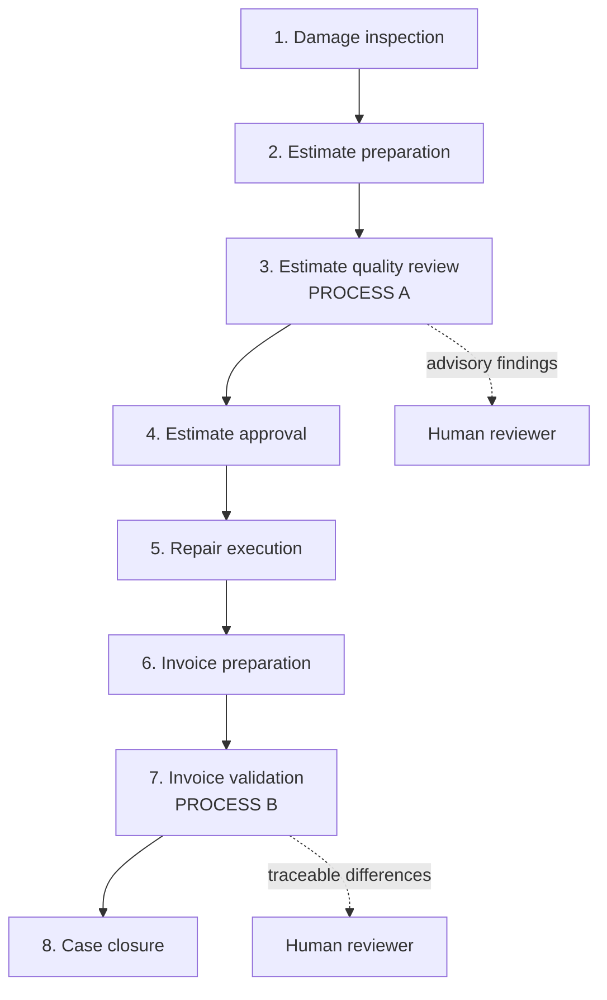

# Business Processes — Repair Document Workflows

Status: Phase 4A.1 domain foundation (documentation only)  
Date: 2026-08-06  
Scope: Conceptual. No parsers, engines, or production UI in this phase.

## Purpose

CM Flow Manager will support **two separate repair-document business processes**. They must never be merged into a single “compare documents” feature.

| Process | Name | Timing | Objective |
| --- | --- | --- | --- |
| **A** | Estimate Quality Review | Before estimate approval | Completeness and repair-logic validation of the estimate |
| **B** | Invoice Validation | After approved estimate + completed repair + invoice | Financial and positional reconciliation of approved estimate vs invoice |

**Process A does not** compare an estimate with an invoice.  
**Process B does not** decide whether calibration or another technological operation should originally have been on the estimate.

---

## Repair lifecycle (eight stages)

### 1. Damage inspection

| Field | Description |
| --- | --- |
| Business objective | Capture vehicle damage and context needed to plan repair |
| Inputs | Vehicle, photos/notes, prior history (optional), plate / VIN |
| Outputs | Inspection notes, damage description, case identifiers |
| Responsible user | Estimator / body-shop advisor / expert |
| Risks | Incomplete damage capture → incomplete estimate later |
| Future CM Flow Manager module | Case / intake (post-MVP; not scheduled in 4A.1) |
| AI useful? | Optional assist for checklist prompts — never authoritative |
| Deterministic rules? | Optional validation of required intake fields |
| Human approval mandatory? | Yes for accepting inspection as basis of estimate |

### 2. Estimate preparation

| Field | Description |
| --- | --- |
| Business objective | Produce a repair estimate (parts, labour, paint, materials, etc.) |
| Inputs | Inspection result, OEM/procedure data, labour guides, shop rates |
| Outputs | Draft estimate document / export |
| Responsible user | Estimator |
| Risks | Omitted operations, wrong parts, inconsistent repair logic |
| Future CM Flow Manager module | Estimate ingest (Phase 4C+) |
| AI useful? | Later assist for suggesting checks — not silent insertion of lines |
| Deterministic rules? | Parsing/normalization once document model exists |
| Human approval mandatory? | Estimator owns the draft before Process A |

### 3. Estimate quality review — **PROCESS A**

| Field | Description |
| --- | --- |
| Business objective | Check whether the estimate is complete, technically consistent, and likely contains required technological operations |
| Inputs | Draft (or submitted) estimate; Estimate QA knowledge; manufacturer/procedure sources when approved |
| Outputs | Advisory findings (missing calibration/coding/diagnostics/etc.), severity, evidence, unexplained gaps |
| Responsible user | Estimator / shop QA / expert before insurer/Arval/other approval |
| Risks | False certainty (“must include X”); mixing with invoice comparison |
| Future CM Flow Manager module | **Estimate QA** (`EstimateQaEngine` — conceptual) |
| AI useful? | Investigate patterns, propose candidate rules; explain findings |
| Deterministic rules? | **Required** for approved QA checks |
| Human approval mandatory? | Yes — warnings are advisory; approval of estimate remains human/insurer |

Examples of Process A concerns (non-exhaustive): missing radar/camera/ADAS calibration, coding, programming, diagnostic scan, wheel alignment, battery registration, paint/dismantling dependencies, inconsistent repair logic, other omitted technological operations.

### 4. Estimate approval

| Field | Description |
| --- | --- |
| Business objective | Authorizing party accepts the estimate as the commercial/technical baseline |
| Inputs | Estimate after Process A (optional), negotiation notes |
| Outputs | **Approved estimate** (baseline for later Process B) |
| Responsible user | Insurer, Arval expert, fleet manager, or other authorizing party |
| Risks | Approving incomplete estimate; baseline mismatch later |
| Future CM Flow Manager module | Store approved baseline reference (later) |
| AI useful? | No decision role |
| Deterministic rules? | Capture approval metadata when available |
| Human approval mandatory? | **Yes** — external or shop authority |

### 5. Repair execution

| Field | Description |
| --- | --- |
| Business objective | Perform the approved repair |
| Inputs | Approved estimate, parts, labour |
| Outputs | Work completed; possible mid-repair changes |
| Responsible user | Technicians / shop |
| Risks | Scope creep vs approved baseline; undocumented substitutions |
| Future CM Flow Manager module | Out of scope for document engines (may log case notes later) |
| AI useful? | No |
| Deterministic rules? | No |
| Human approval mandatory? | Shop process; not CM Flow Manager gate in 4A.1 |

### 6. Invoice preparation

| Field | Description |
| --- | --- |
| Business objective | Create final commercial invoice for the completed repair |
| Inputs | Approved estimate, actual parts/labour/paint/materials, shop billing |
| Outputs | Invoice document / export |
| Responsible user | Billing / estimator / office |
| Risks | Line drift from approved estimate without explanation |
| Future CM Flow Manager module | Invoice ingest (Phase 4C+) |
| AI useful? | Later assist for mapping lines — not silent equivalence |
| Deterministic rules? | Parsing/normalization once document model exists |
| Human approval mandatory? | Shop releases invoice |

### 7. Invoice validation — **PROCESS B**

| Field | Description |
| --- | --- |
| Business objective | Compare **approved estimate** with **invoice** and explain every numerical difference |
| Inputs | Approved estimate, invoice, Invoice Validation knowledge, Parts Intelligence |
| Outputs | Line/position diffs, price/qty/discount/labour/paint/materials/normalia/VAT/total decomposition, residual unexplained amount |
| Responsible user | Billing controller / estimator / insurer reviewer |
| Risks | Treating Process A findings as invoice diffs; silent part-number equivalence |
| Future CM Flow Manager module | **Invoice Validation** (`InvoiceValidationEngine` — conceptual) |
| AI useful? | Explain mismatches, investigate part supersession candidates |
| Deterministic rules? | **Required** — numerical truth for money/hours/qty |
| Human approval mandatory? | Yes before accepting AI part relationships or closing disputes |

Examples of Process B concerns: estimate line missing on invoice; invoice line missing on estimate; price/qty/discount/labour hours/rate/paint/materials/normalia/VAT/total differences; different part numbers (supersession, equivalent, alternate supplier, typo, unrelated, unresolved).

### 8. Case closure

| Field | Description |
| --- | --- |
| Business objective | Close the commercial/technical case after reconciliation |
| Inputs | Process B result, payment/settlement status |
| Outputs | Closed case; optional knowledge candidates from review |
| Responsible user | Office / controller |
| Risks | Closing with unexplained residual difference |
| Future CM Flow Manager module | Case status (later) |
| AI useful? | Optional summary — not auto-close |
| Deterministic rules? | Residual must be zero or explicitly accepted by human |
| Human approval mandatory? | **Yes** |

---

## Separation rules (normative)

1. Process A runs **before** approval; Process B runs **after** invoice exists.
2. Process A knowledge must not be applied as Process B “missing line” financial rules without an explicit, separate approved rule.
3. Process B must not assert that an ADAS/calibration/etc. operation “should have been on the estimate” — that is Process A territory.
4. Shared infrastructure (document model, local storage, Parts Intelligence) may be reused; **workflows, UIs, and rule catalogs stay separate**.

## Open domain questions

See Phase 4A.1 report — e.g. exact Audatex/insurer document variants, normalia calculation conventions, VAT presentation, multi-currency, and which authorizing parties produce machine-readable approvals.
